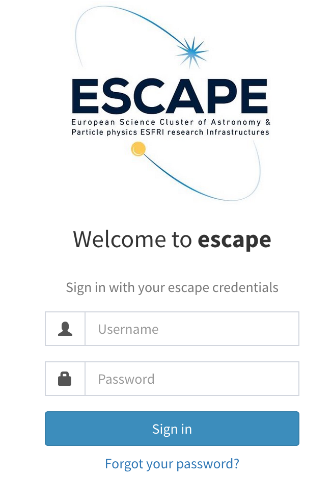

# IAM ESCAPE OAuth Example with Flask

Install requirements (into your venv):

```bash
pip install Flask
pip install Flask-Dance
``` 

Set the following environment variables:

```bash
export IAM_CLIENT_ID="IAM CLIENT ID"
export IAM_CLIENT_SECRET="<IAM CLIENT SECRET"
export SECRET_KEY="<SOME RANDOM VALUE>"
```

Run `flask --debug run` and open the website.

You should be redirected to IAM ESCAPE and after successful authentication returned to the Flask website where the JSON with your user details will be displayed. See example pictures below:



```json
{"sub":"xyz","name":"xyz","preferred_username":"xyz","given_name":"xyz","family_name":"xyz","updated_at":1663750303,"email":"xyz","email_verified":true}
```